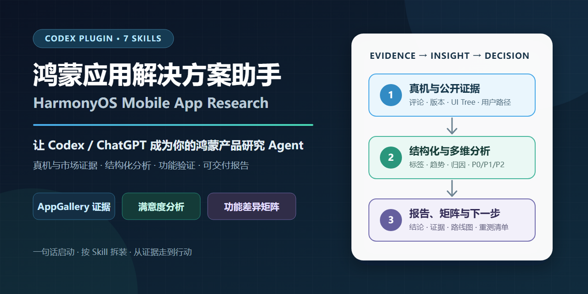
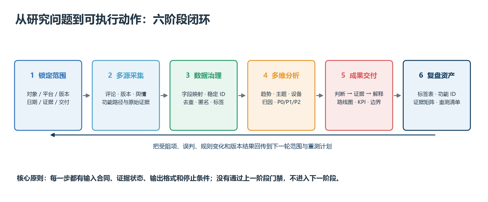

# HarmonyOS Mobile App Research



**Turn Codex or ChatGPT into a HarmonyOS product-research agent—from AppGallery and device evidence to structured analysis, feature verification, and decision-ready reports.**

[中文说明](README.md) · [Quick install](#quick-install) · [How the 7 skills work](docs/SKILL_WORKFLOWS.md) · [Workflow methodology](examples/workflow-methodology/README.md) · [License scope](LICENSE-SCOPE.md)

This is more than an ArkTS coding helper. It packages the fragmented work of mobile-app research—device checks, AppGallery reviews and releases, feedback tagging, satisfaction analysis, report generation, and Android/HarmonyOS feature comparison—into seven composable Codex skills.

## What changes for the user

| Before | With the agent workflow |
|---|---|
| Connect a phone, search for HDC commands, inspect device state, and locate a UDID in terminal output | Ask the agent to verify one connected HarmonyOS target and retrieve the required UDID |
| Scroll through reviews, copy dates and ratings, then clean spreadsheets by hand | Define an app and date window; collect, audit, tag, and export structured review data |
| Compare Android and HarmonyOS from screenshots and memory | Follow the same user journey on both platforms and build an evidence-backed difference matrix |
| Keep reviews, releases, sentiment, and feature findings in separate documents | Compose skills into an evidence-to-decision workflow |

UDID retrieval is an extension of the existing device-connection and feature-inventory workflow, not a separate eighth skill. The agent first verifies HDC state and stops when the target is ambiguous.

## The workflow



You do not have to run every stage. Start with tagging when you already have a CSV, use release collection for a version review, or run feature inventory by itself for platform parity work.

## Start with a prompt

### Retrieve a HarmonyOS device UDID

> Check the available HarmonyOS test devices. Only after confirming one unambiguous Connected target, retrieve the UDID required for this debugging session and report the device state and command used. Stop if no device or more than one target is available.

### Turn AppGallery reviews into a satisfaction report

> Analyze July 2026 HarmonyOS satisfaction for “Sample App.” Collect the latest AppGallery reviews and official release records, audit duplicates and date gaps, tag the feedback, run multidimensional analysis, and produce a report with evidence references and limitations.

### Compare Android and HarmonyOS features

> Verify the “Home → Search → Results → Player” journey on Android and HarmonyOS. Distinguish verified, entry-only, verified-absent, unchecked, and blocked states. Export a feature tree, difference matrix, and retest list.

## Quick install

Prerequisites: a plugin-capable Codex CLI or ChatGPT desktop app, plus Git access to GitHub.

```powershell
codex plugin marketplace add joeaoe-hash/harmonyos-mobile-app-research
codex plugin add harmonyos-mobile-app-research@harmonyos-mobile-app-research
```

After installation or upgrade, start a new task so the updated skills are loaded.

## The seven skills

| Skill | Purpose | Main outputs |
|---|---|---|
| `collect-appgallery-reviews` | Collect recent AppGallery reviews and audit virtual-list gaps | CSV, JSON, Markdown, checkpoints |
| `collect-appgallery-updates` | Preserve official releases, trials, and test-plan boundaries | Version timeline and structured records |
| `collect-xiaohongshu-app-sentiment` | Reconstruct post/comment context and identify discussion themes | Anonymized sample and sentiment summary |
| `app-review-tagging` | Convert free-form feedback into stable, auditable labels | JSONL, CSV, tag statistics |
| `app-satisfaction-analysis` | Analyze trends, themes, devices, regions, and priorities | Metrics, charts, P0/P1/P2 recommendations |
| `app-satisfaction-report` | Assemble analysis into a decision-ready report | Markdown and DOCX/PDF reports |
| `inventory-mobile-app-features` | Inventory user journeys and compare platform parity | Feature tree, evidence matrix, retest list |

See [SKILL_WORKFLOWS.md](docs/SKILL_WORKFLOWS.md) for each skill's inputs, internal process, outputs, dependencies, examples, and stopping conditions.

## Output references

- [Workflow methodology](examples/workflow-methodology/README.md) (copyright reserved; output reference only)
- [Report output specification](plugins/harmonyos-mobile-app-research/skills/app-satisfaction-report/references/examples/report-method-standard.md) (copyright reserved; output reference only)
- [Complete report example](plugins/harmonyos-mobile-app-research/skills/app-satisfaction-report/references/examples/kugou-harmony-satisfaction-gold-example.md) (copyright reserved; output reference only)
- [Dependency guide](DEPENDENCIES.md)

## HarmonyOS PC, Codex, ChatGPT, and Cursor

For users searching for Codex, ChatGPT, Cursor, or AI-agent workflows on a HarmonyOS PC, the currently described path is:

`HarmonyOS PC → Windows virtual machine → Codex / ChatGPT / Cursor → repository skills`

This is a Windows-VM workflow on a HarmonyOS PC, not a claim of native HarmonyOS desktop support.

## Contributing and license

Read [CONTRIBUTING.md](CONTRIBUTING.md) to propose a use case, improve a workflow, or report a reproducible issue. If this project saves you time or helps you make a better-supported product decision, consider starring the repository so other HarmonyOS practitioners can find it.

Skills, scripts, prompts, schemas, templates, synthetic fixtures, and general project documentation are open source under the [MIT License](LICENSE).

Completed reports, methodology deliverables, companion editions, charts, and layout assets are excluded from MIT and remain copyright-protected. See [LICENSE-SCOPE.md](LICENSE-SCOPE.md) for the exact directory boundaries.
