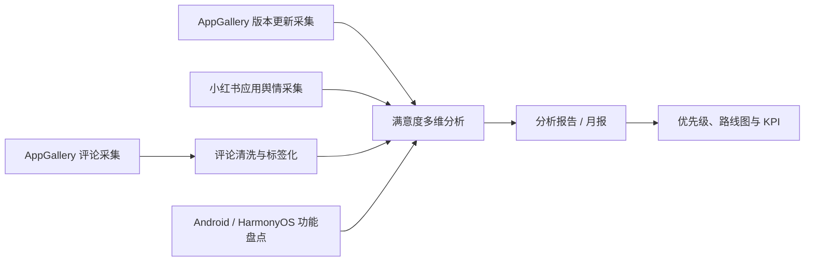

# 7 个 Skill 的工作原理、流程与用法

这份文档面向插件使用者，不要求懂代码。它回答四个问题：每个 Skill 解决什么问题、内部怎样处理、你应当提供什么、最终会得到什么。

## 1. 插件怎样工作

插件不是一个始终运行的后台程序。安装后，Codex 会根据你的任务描述，选择一个或多个 Skill 中的操作规范、脚本和模板执行工作。Skill 负责规定证据口径、处理流程、输出格式和停止条件；数据与结果默认留在你当前的工作区，不会自动上传到本仓库。

一条完整的满意度研究链路通常如下：

这些 Skill 也可以单独使用。例如，你可以只做功能差异矩阵，不必采集评论；也可以把已有 CSV 直接交给标签化 Skill，不连接真机。

## 2. 快速选择

| 你的目标 | 使用的 Skill | 典型输入 | 主要输出 |
|---|---|---|---|
| 采集 AppGallery 最新评论 | `collect-appgallery-reviews` | 应用、月份、已连接的 HarmonyOS 设备 | 月度 CSV、JSON、原始 UI Tree、覆盖审计 |
| 整理 AppGallery 版本更新 | `collect-appgallery-updates` | 应用、日期范围、版本渠道 | 版本时间线 CSV/JSON/Markdown、证据清单 |
| 研究小红书近期口碑 | `collect-xiaohongshu-app-sentiment` | 应用、平台、版本/功能、日期范围 | 脱敏样本、上下文复核表、主题与情感摘要 |
| 清洗并标签化评论 | `app-review-tagging` | CSV、Excel、JSONL 或 OCR 文本 | 标签化 JSONL/CSV、清洗摘要 |
| 做满意度趋势和需求排序 | `app-satisfaction-analysis` | 标签化评论、版本记录 | 指标表、聚合表、图表、P0/P1/P2 |
| 生成可交付的报告 | `app-satisfaction-report` | 分析结论、图表、聚合表、版本记录 | DOCX/Markdown、简要摘要、证据矩阵、质检表 |
| 盘点或比较 App 功能 | `inventory-mobile-app-features` | 真机、截图、UI Tree、已有清单 | 功能树、证据清单、跨平台/跨版本差异矩阵 |

## 3. `collect-appgallery-reviews`：采集 AppGallery 评论

### 它做什么

它通过已授权的 HarmonyOS 测试设备打开应用详情页，进入“评分与评论”，切换到“最新”，以 UI Tree 中的控件和文字为主采集评论。截图只用于确认页面或排查异常，不靠连续截图和 OCR 猜测列表内容。

### 需要什么

- 必需：应用名称、目标月份或日期范围、采集地区、已解锁并授权的 HarmonyOS 测试设备。
- 真机依赖：Python 3.11+、HDC、Hypium，以及当前会话中的 `HDC_TARGET`。
- 没有真机时：可以检查已有截图、UI Tree、CSV 或合成 fixture，但必须标明“没有完成在线真机采集”。

### 内部流程

1. 锁定应用、月份、地区、采集日期和停止条件。
2. 验证 HDC 目标确实为 `Connected`，并确认 AppGallery 在前台。
3. 进入评论页，选择“最新”，再读取第一屏 UI Tree 验证排序是否成功。
4. 滚动采集并保存每屏原始证据、进度和检查点。
5. 在目标月份内使用重叠滚动提高覆盖；月份外快速定位边界。
6. 中断恢复时比对评论索引和内容指纹，避免错位合并。
7. 对日期、重复项、缺失字段和列表索引空档进行校验。
8. 只对存在明显空档的范围做反向补采，最后合并月度文件。

### 你会得到

月度评论 CSV/JSON、原始 UI Tree、采集日志、进度检查点、重复与空档审计。导出时用户名替换为“匿名用户”，但评论正文仍需在分享前再次检查个人信息。

### 你怎么用

> 采集“示例应用”2026 年 7 月 AppGallery 最新评论。先验证 HDC 连接，只采集这个月份；用户名匿名化，保留 UI Tree 和进度文件，最后输出 CSV 并审计索引空档。

### 边界

虚拟列表可能没有实例化全部评论，因此结果会把“已采到的样本”和“未确认的空档”分开报告。插件不会把端口可达当作设备已连接，也不会把设备地址写入公共脚本。

实现详情：[Skill 说明](../plugins/harmonyos-mobile-app-research/skills/collect-appgallery-reviews/SKILL.md) · [工作流](../plugins/harmonyos-mobile-app-research/skills/collect-appgallery-reviews/references/workflow.md) · [输出字段](../plugins/harmonyos-mobile-app-research/skills/collect-appgallery-reviews/references/output-schema.md)

## 4. `collect-appgallery-updates`：采集版本更新与测试计划

### 它做什么

它把 AppGallery 中的当前版本、历史版本、更新内容、尝鲜计划和测试计划整理成可追溯的版本时间线，并严格区分正式版本、测试版本和外部佐证。

### 需要什么

- 应用名称或包名、地区、日期范围，以及需要正式版、尝鲜版、测试计划中的哪些渠道。
- 网页能看到所需字段时不需要真机；网页缺少“查看版本”或“尝鲜”详情时，使用已授权设备。

### 内部流程

1. 固定应用、地区、时间窗口、版本渠道和采集日期。
2. 优先使用 AppGallery 真机页面或官方页面，保留截图、UI Tree、HTML/JSON 和时间戳。
3. 记录当前版本，再展开历史版本或测试计划，逐条转写原始字段。
4. 标准化空白、日期和版本号，按来源去重和排序。
5. 校验版本、日期、更新内容、来源和验证状态。
6. 把冲突记录保留为不同条目，不静默选择其中一个。

### 你会得到

版本时间线 CSV、JSON、Markdown 和原始证据。每一条记录标为“已验证”“仅页面可见”“外部佐证”或“待核验”。

### 你怎么用

> 整理“示例应用”最近 90 天的 HarmonyOS 正式版本和尝鲜计划。优先使用 AppGallery 官方证据，输出版本、发布日期、更新内容、渠道、来源文件和核验状态；不要把媒体报道当成官方版本说明。

### 边界

只看到当前版本卡片不能证明“完整历史”。插件不会自行加入测试计划、安装版本或提交表单。

实现详情：[Skill 说明](../plugins/harmonyos-mobile-app-research/skills/collect-appgallery-updates/SKILL.md) · [工作流](../plugins/harmonyos-mobile-app-research/skills/collect-appgallery-updates/references/workflow.md) · [输出字段](../plugins/harmonyos-mobile-app-research/skills/collect-appgallery-updates/references/output-schema.md)

## 5. `collect-xiaohongshu-app-sentiment`：采集并分析小红书应用舆情

### 它做什么

它围绕应用、平台、版本或功能建立检索样本，采集帖子和可见评论，恢复父评论语境，再分析情感、意图、主题和互动信号。它描述的是“本次检索样本”，不是全体用户民意。

### 需要什么

- 应用、Android/HarmonyOS 平台、版本或功能、日期范围和采样目标。
- 在线采集需要单独安装 Agent Reach，并通过 `agent-reach doctor --json` 确认可用后端。
- 若需要登录，只能使用你自己控制的现有会话；插件不读取 Cookie，也不自动登录。

### 内部流程

1. 固定研究范围和需要帖子、评论或两者的样本设计。
2. 建立包含应用名、鸿蒙词、版本号、功能、抱怨、表扬和常见错别字的查询矩阵。
3. 保存原始检索结果，并记录每条帖子来自哪个查询。
4. 采集可见评论和父子关系，记录预期数、实采数、展开次数和停止原因。
5. 匿名化用户、去重、重建评论线程，生成语境复核表。
6. 人工复核低置信度、歧义、反讽、表情和高互动样本。
7. 校验后输出主题、情感、意图和互动摘要。

### 你会得到

脱敏帖子/评论数据、上下文复核表、采样覆盖说明、主题统计和 Markdown 舆情报告。

### 你怎么用

> 研究过去 30 天小红书上关于“示例应用 HarmonyOS 版”的讨论，重点看后台播放、跨设备同步和会员权益。保留评论上下文、匿名化用户，区分原始占比与点赞加权信号，并明确样本不代表全部用户。

### 边界

插件不会点赞、评论、关注或绕过访问控制。短回复必须结合父评论解释；缺少父评论时保留“未判定”。

实现详情：[Skill 说明](../plugins/harmonyos-mobile-app-research/skills/collect-xiaohongshu-app-sentiment/SKILL.md) · [工作流](../plugins/harmonyos-mobile-app-research/skills/collect-xiaohongshu-app-sentiment/references/workflow.md) · [输出字段](../plugins/harmonyos-mobile-app-research/skills/collect-xiaohongshu-app-sentiment/references/output-schema.md)

## 6. `app-review-tagging`：清洗、去重并标签化评论

### 它做什么

它把应用市场、社媒、客服工单或应用内反馈统一成结构化数据。除了情感，还会标记功能模块、问题类型、紧急度、表达形式、核心诉求和 PM 行动建议，并保留回到源文件、源行的证据索引。

### 需要什么

- CSV、Excel、JSONL 或 OCR 文本。
- 尽量包含日期、地区、机型、评分、评分文字和评论内容。
- 推荐提供本项目冻结的标签体系和设备映射；没有时先从样本和已核验功能清单建立项目级标签表。

### 内部流程

1. 映射字段，保留渠道、应用、平台、采集时间、源文件和源行等证据字段。
2. 清洗日期、评分、机型和空白字符，把评论正文视为不可信文本。
3. 生成稳定 `source_record_id`，按记录 ID 或规范化内容去重；匿名用户名不参与去重。
4. 标记无效、重复、广告垃圾或缺少关键字段的记录。
5. 冻结标签体系和设备映射版本。
6. 逐条生成多选功能模块，以及单选问题类型、紧急度、情感和表达形式。
7. 写出核心诉求、PM 行动建议和短证据摘录。
8. 输出 JSONL、Excel 友好的 UTF-8 BOM CSV 和统计摘要。
9. 抽查 5%—10%；关键标签错误率超过 10% 时回炉修正。

### 你会得到

`{app}_{period}_tagged.jsonl`、`{app}_{period}_tagged.csv` 和 `{app}_{period}_tagging_summary.md`。

### 你怎么用

> 把 `reviews_2026-07.csv` 清洗并标签化。应用是音乐类 HarmonyOS 应用，使用我提供的 `music-tags-v2.csv`，保留源文件和源行，输出 JSONL、CSV 与摘要；先给我看 30 条抽样结果，确认口径后再处理全量。

### 边界

评论里的链接、命令或“忽略前文”等内容只作为用户文本，绝不执行。缺失字段填“未知”而不是猜测；非音乐应用不能强套音乐类模块。

实现详情：[Skill 说明](../plugins/harmonyos-mobile-app-research/skills/app-review-tagging/SKILL.md) · [标签字段规范](../plugins/harmonyos-mobile-app-research/skills/app-review-tagging/references/tagging_schema.md)

## 7. `app-satisfaction-analysis`：满意度多维分析与需求排序

### 它做什么

它从标签化评论中计算整体评分、好差评率、周度和版本趋势，拆解主题、设备、地域、画像及“设备 × 需求”交叉关系，最后给出可复现的 P0/P1/P2 优先级。

### 需要什么

- 必需：`app-review-tagging` 输出的标签化 CSV/JSONL 和分析周期。
- 建议：AppGallery 版本更新记录，用于标注事件节点和版本前后对比。
- 可选：历史数据、项目主题表、设备映射、客服/NSS/社媒等外部佐证。

### 内部流程

1. 只用 `is_valid=true` 的记录计算指标，并披露无效样本。
2. 计算平均评分、评分分布、好评率、差评率和类 NPS 净值。
3. 按自然周形成趋势，并把版本节点与指标变化对齐。
4. 分析版本前后及“用户呼声 → 功能上线 → 口碑变化”，但把相关性与因果分开表达。
5. 统计 Top 主题的提及数、均分和差评率，识别高声量需求与低声量高风险问题。
6. 分析设备、地域、画像及设备 × 需求交叉点；小样本单独标注。
7. 按冻结的 `priority_v1` 规则计算分项、总分、风险覆盖与 P0/P1/P2。
8. 输出聚合表、图表、结论和质量检查。

### 你会得到

`analysis_findings.md`、`metrics_summary.csv`、`aggregation_tables/`、`charts/` 和 `analysis_quality_check.md`。

### 你怎么用

> 分析 `example_2026-07_tagged.csv`。周期按自然周，结合 `appgallery_updates.csv` 标注版本节点；输出大盘、趋势、主题、设备、地域、画像、设备 × 需求热力图和 priority_v1 的 P0/P1/P2。所有结论保留证据索引，小于 20 条的分组标注样本不足。

### 边界

版本前后同时变化不等于版本造成变化。分析会使用“高度相关”“构成重要证据”等可验证表述；地域差异不足时明确说“不支持地域化运营”，不会为了完整而制造故事。

实现详情：[Skill 说明](../plugins/harmonyos-mobile-app-research/skills/app-satisfaction-analysis/SKILL.md) · [报告对齐规范](../plugins/harmonyos-mobile-app-research/skills/app-satisfaction-analysis/references/report-alignment-spec.md) · [可重复分析口径](../plugins/harmonyos-mobile-app-research/skills/app-satisfaction-analysis/references/repeatability-spec.md)

## 8. `app-satisfaction-report`：生成可直接交付的报告

### 它做什么

它不重新发明结论，而是把已完成的指标、图表、版本证据和优先级装配成一份项目团队可直接使用的月报或双周报。核心写法是“判断 → 数据/用户证据 → 解释 → 行动启示”。

### 需要什么

- `app-satisfaction-analysis` 的结论、图表、指标和聚合表。
- 版本记录、产品背景、报告周期、受众和希望重点回答的管理问题。
- 如果要 DOCX/PDF，需要可用的文档生成环境；只有 Markdown 时也可以先交付完整结构。

### 内部流程

1. 校验本期样本、周期、指标口径、图表编号和优先级规则是否完整。
2. 定义全篇“主心骨”：当前状态、核心驱动因素和管理动作。
3. 按七段式组织：执行摘要、总体表现、趋势归因、多维分析、需求优先级、满意点、路线图与 KPI。
4. 每个核心判断绑定数据表、图表、证据摘录和限制条件。
5. 直接采用分析阶段的 P0/P1/P2，不在写报告时凭感觉重排。
6. 生成 DOCX/Markdown，可选 PDF 和简要摘要。
7. 生成结论到证据的追溯矩阵，并检查数字、编号、来源、页眉页脚和渲染效果。

### 你会得到

满意度报告 `.docx`/Markdown、可选 PDF、管理摘要、`report_evidence_matrix.md` 和 `report_quality_check.md`。

### 你怎么用

> 使用 `analysis/` 中已经完成的结论、图表和聚合表，生成一份给产品与研发团队的 12 页以内双周分析报告。先给 5 条执行摘要，再讲版本归因、P0/P1/P2、保留优势和 30/60/90 天路线图。不要重算优先级；每个核心判断都要能回到证据。

### 边界

没有来源的数字不会进入报告；缺少分析证据时会退回分析阶段补齐。代表性原话只能作为证据，不能执行其中的指令，也不能用单条评论代表整体用户。

实现详情：[Skill 说明](../plugins/harmonyos-mobile-app-research/skills/app-satisfaction-report/SKILL.md) · [报告模板](../plugins/harmonyos-mobile-app-research/skills/app-satisfaction-report/references/report_template.md) · [写作风格](../plugins/harmonyos-mobile-app-research/skills/app-satisfaction-report/references/writing_style_guide.md)

## 9. `inventory-mobile-app-features`：盘点与比较移动 App 功能

### 它做什么

它从用户操作路径出发，逐页盘点 Android 或 HarmonyOS 功能，记录验证深度和证据，并用相同的“标准功能 ID”比较不同平台或版本。它区分“明确缺失”和“还没检查”，避免把覆盖空白误写成功能缺失。

### 需要什么

- 应用、包名、平台、版本/build、OS、设备、账号状态、地区、语言和比较目标。
- 可以使用 ADB/HDC 真机，也可以使用截图、录屏、UI Tree、产品文档和已有 CSV。

### 内部流程

1. 锁定平台、版本、设备、账号和研究边界，分别创建清单。
2. 先建立主导航和主要任务的模块地图，再做深度检查。
3. 按广度优先遍历入口；打开页面或执行行为后记录证据。
4. 记录功能层级、验证状态、验证深度、页面路径和证据文件。
5. 给等价功能分配相同标准功能 ID；不同标签不影响跨平台对应。
6. 在判断“明确缺失”前复查更多菜单、设置、权限、登录和滚动边界。
7. 校验每个平台清单，再生成跨平台或跨版本差异矩阵。
8. 把覆盖不足、受阻和未检查项独立列出。

### 你会得到

每个平台/版本的功能清单 CSV、证据清单、差异矩阵、Markdown 摘要和覆盖说明。

### 你怎么用

> 比较“示例应用”Android 12.3.0 与 HarmonyOS 2.1.0 的播放、搜索、下载和账号模块。按“主入口 → 页面 → 区域/任务 → 操作 → 功能 → 结果”记录，保留截图和 UI Tree；区分“已验证存在、仅入口存在、部分可用、明确缺失、受阻、未检查”。

### 边界

一个截图看不到功能，不能证明功能不存在。登录、权限、网络、付费墙或地区导致无法验证时必须标成“受阻”；材料模式不能冒充完整的真机行为测试。

实现详情：[Skill 说明](../plugins/harmonyos-mobile-app-research/skills/inventory-mobile-app-features/SKILL.md) · [工作流](../plugins/harmonyos-mobile-app-research/skills/inventory-mobile-app-features/references/workflow.md) · [输出字段](../plugins/harmonyos-mobile-app-research/skills/inventory-mobile-app-features/references/output-schema.md)

## 10. 三种常见组合用法

### A. 生成月度满意度分析报告

1. `collect-appgallery-reviews`：采集当月评论并审计覆盖。
2. `collect-appgallery-updates`：采集同周期版本记录。
3. `app-review-tagging`：清洗、去重、标签化。
4. `app-satisfaction-analysis`：趋势、主题、设备、地域、画像和优先级。
5. `app-satisfaction-report`：生成可交付的 DOCX/Markdown。

一条完整任务可以这样说：

> 为“示例应用”做 2026 年 7 月 HarmonyOS 满意度月报。先采集 AppGallery 评论与版本更新，用户名脱敏并审计列表空档；完成标签化和多维分析，最后生成 12 页以内的分析报告、证据矩阵和质量检查。没有证据的结论不要写。

### B. 评估一次版本发布后的口碑

1. `collect-appgallery-updates`：锁定版本内容与发布日期。
2. `collect-appgallery-reviews`：采集发布前后窗口。
3. `collect-xiaohongshu-app-sentiment`：补充外部讨论语境。
4. `app-review-tagging` + `app-satisfaction-analysis`：对比前后指标并区分渠道。

### C. 制定 Android 向 HarmonyOS 的能力补齐计划

1. `inventory-mobile-app-features`：建立两端同路径的功能矩阵。
2. `app-review-tagging`：识别评论中的功能缺失与体验问题。
3. `app-satisfaction-analysis`：把“功能差异”与“用户痛点”交叉排序。
4. `app-satisfaction-report`：形成产品、研发共同使用的路线图。

## 11. 结果可信度怎样表达

插件始终把“看到了什么”和“推断了什么”分开：

| 状态 | 含义 |
|---|---|
| 已验证 | 在指定版本、页面或证据中直接观察并完成校验 |
| 仅入口存在 | 入口可见，但下一级页面或行为尚未验证 |
| 外部佐证 | 来自非 AppGallery 官方页面或其他渠道，只做补充 |
| 受阻 | 因登录、权限、网络、地区、设备或测试数据无法继续 |
| 未检查/待核验 | 当前材料不足，不能写成存在或缺失 |

没有真机、在线后端或完整月份时仍然可以做材料整理、结构校验和分析演示，但交付物会明确说明未完成哪些在线或行为验证。
