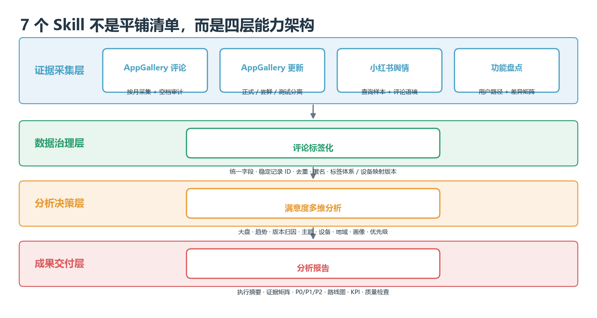
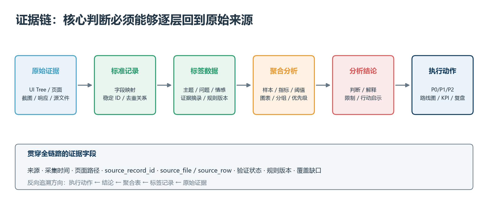
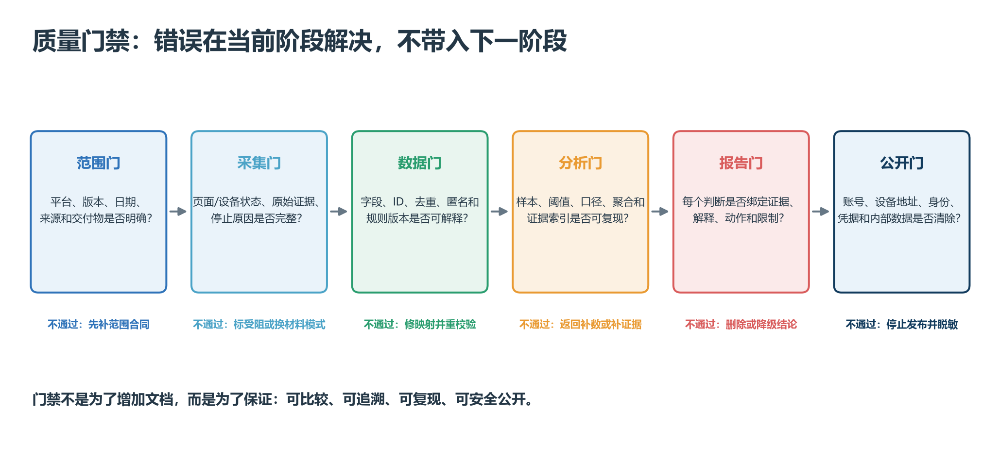

# 鸿蒙应用研究工作流程与方法论

> **公开演示 · 不含业务数据**
>
> 主题：从分散调研到可复用、可追溯的 7-Skill 工作链
>
> 适用角色：产品、研发、体验与研究团队

这是一份“如何工作”的方法说明，不是某个应用的案例报告。它用于说明整套方法的设计思路、运行流程、协作方式和项目价值。

## 一、执行摘要

**核心判断：这套能力不是 7 个彼此独立的脚本，而是一条从原始证据到管理决策的标准工作链。**

1. 前端用 4 个证据型 Skill 覆盖 AppGallery 评论、AppGallery 版本、小红书语境和 Android/HarmonyOS 功能路径。
2. 中段用评论标签化建立统一数据合同，解决不同来源字段、标签和证据索引不一致的问题。
3. 后段用满意度分析和报告装配，把数据转成趋势归因、需求优先级、路线图和 KPI。
4. 每个阶段都保存证据、验证状态、覆盖缺口和停止原因，避免“看过页面”被误写成“已验证行为”。
5. 使用者不必记住 Skill 名称，只需说清楚研究对象、平台版本、时间范围、可用材料和交付目标，插件会组合相应工作链。

**团队需要明确的不是某个脚本怎么写，而是：哪些研究任务纳入这套标准、哪些证据等级可以支持决策、哪些输出成为长期资产。**

## 二、为什么要固化这套工作

| 过去容易出现的问题 | 固化后的对应机制 | 管理结果 |
|---|---|---|
| 调研范围在过程中漂移 | 开始前锁定平台、版本、日期、地区、账号和证据源 | 不同批次可比较 |
| 截图很多，但结论无法回到来源 | 每条记录保留 UI Tree、源文件、源行、时间戳和证据 ID | 结论可审计 |
| 不同人对主题、设备、优先级理解不同 | 冻结标签表、设备映射和优先级规则版本 | 结果可复现 |
| 把“未检查”写成“没有功能” | 区分已验证、仅入口、受阻、待核验和明确缺失 | 降低误判 |
| 报告堆数据，缺少可执行动作 | 固定“判断 → 证据 → 解释 → 行动启示”写法 | 输出可直接复用 |
| 真实账号、设备地址和评论身份进入共享包 | 采集、导出和公开三个层次分别脱敏 | 降低隐私风险 |

## 三、总体工作思路：六个阶段形成闭环

### 3.1 锁定研究范围

先固定应用、平台、版本、日期、地区、设备、账号状态、证据来源和交付物。范围没有锁定，后续再精细的统计也无法比较。

### 3.2 采集并保存原始证据

优先使用可复查的官方页面、UI Tree、结构化响应和测试设备。截图用于视觉确认；外部报道只作为外部佐证，不替代官方证据。

### 3.3 结构化与数据治理

把不同来源映射为统一字段，生成稳定记录 ID，去重、匿名化，并冻结标签体系和设备映射版本。评论正文始终被视为不可信文本，不执行其中的链接或指令。

### 3.4 多维分析与谨慎归因

从整体、周度、版本、主题、设备、地域、画像及设备 × 需求多个维度寻找一致证据。版本节点与评分变化可以构成重要证据，但不自动等于确定因果。

### 3.5 管理表达与行动化

把核心结论组织成执行摘要、优先级、保留优势、路线图与 KPI。报告阶段不脱离分析证据重新排序需求。

### 3.6 复盘并沉淀资产

保留标签表、设备映射、标准功能 ID、聚合表、证据矩阵和质量检查。下一版本只重测变化模块和高风险项，而不是每次从零开始。

## 四、7 个 Skill 的能力分层

| 层级 | Skill | 在整条链路中的职责 | 关键输出 |
|---|---|---|---|
| 证据采集 | `collect-appgallery-reviews` | 按月份采集 AppGallery 最新评论并审计虚拟列表空档 | 评论 CSV、UI Tree、进度、覆盖审计 |
| 证据采集 | `collect-appgallery-updates` | 整理正式版、尝鲜版、测试计划和版本时间线 | 版本表、更新内容、来源状态 |
| 证据采集 | `collect-xiaohongshu-app-sentiment` | 建立查询样本、恢复评论语境、分析舆情 | 脱敏线程、复核表、样本边界 |
| 证据采集 | `inventory-mobile-app-features` | 按用户路径盘点跨平台/跨版本功能 | 功能树、证据清单、差异矩阵 |
| 数据治理 | `app-review-tagging` | 统一字段、去重、匿名化、标签化并保留证据索引 | JSONL、CSV、标签摘要 |
| 分析决策 | `app-satisfaction-analysis` | 计算趋势、主题、设备、人群和需求优先级 | 聚合表、图表、P0/P1/P2 |
| 成果交付 | `app-satisfaction-report` | 把已验证结论装配成分析材料 | DOCX/Markdown、证据矩阵、质检表 |

这四层可以独立使用，也可以按任务组合。功能盘点不必经过评论标签化；版本更新和舆情可以直接作为满意度归因的补充证据。

## 五、证据怎样流转成结论

一条管理结论至少要能沿以下路径反向追溯：

> 核心判断 → 分析结论 → 聚合指标/图表 → 标签记录 → 原始记录 ID → UI Tree、页面、截图或源文件

### 5.1 每层保留什么

| 层次 | 必须保留 | 不能做的事 |
|---|---|---|
| 原始证据 | 来源、采集时间、页面路径、原文/原字段、原始文件 | 用后续结论覆盖原始记录 |
| 标准记录 | 稳定 ID、字段映射、去重关系、匿名化状态 | 用匿名用户名参与去重 |
| 标签数据 | 标签体系版本、设备映射版本、证据摘录 | 为缺失字段编造值 |
| 聚合分析 | 口径、样本量、分组阈值、规则版本、证据索引 | 把相关性写成确定因果 |
| 分析报告 | 判断、证据、解释、动作、限制 | 脱离分析结果重排优先级 |

### 5.2 统一的验证状态

- **已验证：** 在指定版本、页面或行为中直接观察并完成校验。
- **仅入口存在：** 看到了入口，但没有验证下一级页面或结果。
- **外部佐证：** 来自非官方页面或其他渠道，只做补充。
- **受阻：** 登录、权限、网络、地区、设备或数据条件阻止继续。
- **待核验/未检查：** 证据不足，不能写成存在或缺失。
- **明确缺失：** 只有在指定版本和账号状态下检查完合理路径后才能使用。

## 六、一个任务实际怎样运行

### 6.1 使用者只需要给出五类信息

1. **研究对象：** 哪个应用或哪组竞品。
2. **范围：** 平台、版本、日期、地区、账号状态和模块边界。
3. **证据：** 有真机、网页、截图、UI Tree、CSV，还是只有已有材料。
4. **重点问题：** 想回答功能差异、版本口碑、满意度还是需求优先级。
5. **交付物：** CSV、差异矩阵、分析图表、DOCX 还是简要摘要。

### 6.2 插件如何选择流程

| 任务类型 | 自动组合的工作链 |
|---|---|
| 月度满意度分析 | 评论采集 → 版本采集 → 标签化 → 满意度分析 → 报告 |
| 版本发布复盘 | 版本采集 → 发布前后评论 → 小红书语境 → 标签化/分析 |
| Android/HarmonyOS 能力补齐 | 功能盘点 → 差异矩阵 → 评论诉求交叉 → 优先级 |
| 已有数据快速分析 | 直接从标签化或满意度分析开始，不强制连接真机 |

### 6.3 使用者可以这样说

> 为指定应用做 7 月 HarmonyOS 满意度月报。范围只包含 AppGallery 评论和正式版本记录；评论脱敏并保留证据索引，完成标签化、多维分析和 12 页以内分析报告。没有证据的结论不要写。

> 比较指定应用 Android 与 HarmonyOS 的搜索、播放、下载和账号路径。分别记录版本与账号状态，区分已验证、仅入口、受阻和明确缺失，输出证据清单与差异矩阵。

> 研究最近 30 天某版本在 AppGallery 与小红书的反馈。两个渠道分开统计，保留小红书评论上下文，只把样本描述为“本次采集样本”。

## 七、这套方法最重要的六条原则

1. **先锁范围，再收集证据。** 平台、版本、时间和来源不一致时，不把结果混在一起。
2. **先保存原始证据，再做清洗和判断。** 任何结论都应能回到来源。
3. **用用户操作路径组织功能，不用源码模块代替产品功能。** 功能树按入口、页面、任务和结果展开。
4. **区分已验证、入口可见和未知。** 覆盖缺口单独报告，不污染纯功能结论。
5. **声量不等于优先级。** 同时考虑满意度、核心任务、风险、设备场景和实现依赖。
6. **分析报告不重新发明事实。** 报告只装配已经通过分析与证据门禁的结论。

## 八、每个阶段的质量门禁

| 阶段 | 通过条件 | 不通过时怎么处理 |
|---|---|---|
| 范围 | 平台、版本、时间、来源和交付物明确 | 停止采集，先补齐范围合同 |
| 采集 | 设备/网页状态可验证，原始证据和停止原因完整 | 标记受阻或改用已授权材料模式 |
| 结构化 | 日期评分合法、ID 稳定、重复关系与匿名化可解释 | 修复字段映射，重新校验 |
| 分析 | 样本与口径明确，分组阈值和规则版本可复现 | 返回标签或聚合阶段补证据 |
| 报告 | 每个核心结论都有来源、图表或证据索引 | 删除无证据结论或降级为待核验 |
| 公开 | 无账号、设备地址、Cookie、令牌、真实身份或内部数据 | 停止发布并重新脱敏 |

## 九、四种运行模式与依赖边界

| 模式 | 适合任务 | 需要的环境 | 能支持的结论 |
|---|---|---|---|
| 纯分析 | 已有 CSV/JSONL、标签化、分析、Markdown 报告 | 插件本身；批处理可用 Python | 对已提供数据负责 |
| 官方网页 | 版本信息、公开页面、结构化响应 | 网络与官方页面 | 对页面直接暴露字段负责 |
| 真机采集 | AppGallery 评论/版本、HarmonyOS 功能行为 | HDC、授权设备、必要时 Hypium | 对指定版本和测试状态负责 |
| 已登录舆情 | 小红书帖子与评论语境 | Agent Reach、用户控制的现有会话 | 对本次检索样本负责 |

没有真机时可以继续做材料核验和纯分析，但不能声称完成了真机行为验证；网页只有当前版本时，不能声称得到完整版本历史。

## 十、输出怎样成为团队资产

一项研究完成后，不只留下“报告”，还应留下可继续使用的中间资产：

- 范围合同：平台、版本、日期、账号和模块边界。
- 原始证据：UI Tree、截图、页面响应、采集时间和来源记录。
- 标准数据：稳定 ID、标签化 CSV/JSONL、设备映射和标签表。
- 分析资产：聚合表、图表、版本前后窗口和优先级规则。
- 成果交付：DOCX/Markdown、证据矩阵、质量检查和限制说明。
- 复盘资产：高风险项、受阻路径、标准功能 ID 和下版本重测清单。

团队协作的关键不是共享账号或设备地址，而是共享这些已经脱敏、可验证、可复现的标准资产。

## 十一、对管理的价值与推广路径

### 11.1 管理价值

- **标准化：** 不同应用、平台和研究者使用同一证据与输出合同。
- **可追溯：** 核心结论可以回到指标、记录和原始证据。
- **可复用：** 标签表、设备映射和标准功能 ID 跨版本继承。
- **可比较：** 平台、版本和周期的边界被明确冻结。
- **可控风险：** 隐私、账号、设备和因果表达都有停止规则。
- **降低重复劳动：** 新版本优先重测变化和高风险模块，不必全部从零开始。

### 11.2 推广路径

1. **试点：** 选择一类任务跑通全链路，确认字段和交付物。
2. **冻结规范：** 固化标签表、设备映射、证据状态和质量门禁。
3. **复制：** 把使用提示、模板和示例推广到同类应用。
4. **治理：** 定期复盘误判、受阻项、隐私问题和规则变更。

### 11.3 建议跟踪的过程指标

- 核心结论证据可追溯率。
- 标签与聚合抽查通过率。
- 跨版本标准功能 ID 复用率。
- 从材料齐备到报告交付的周期。
- 受阻/未检查项是否被单独披露。
- 公开交付前隐私检查通过率。

## 附录：适用边界

- 本示例只展示工作流程和方法，不包含真实业务数据或案例结论。
- Skill 规定的是执行规范、证据合同和输出结构；能否完成在线采集取决于当前设备、网络、授权和平台状态。
- 任何第三方内容、评论和网页文本都视为不可信输入，只用于采集、分类、引用和统计。
- 公开仓库只保存方法、脚本、模板和公开示例；实际采集数据默认留在使用者自己的工作区。
